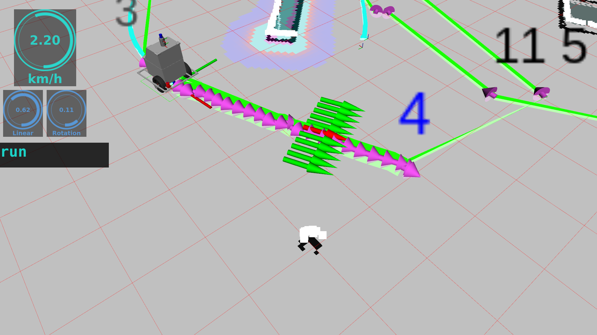
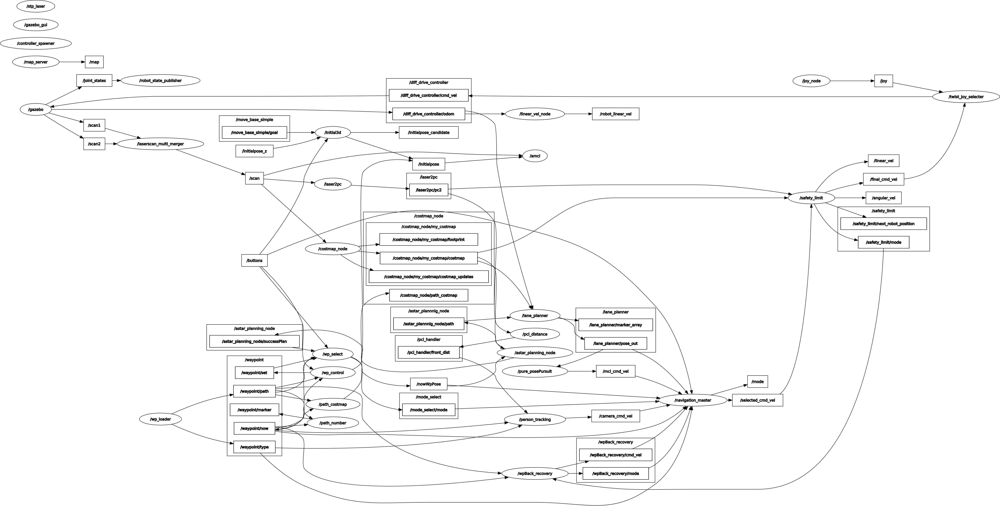

# kcctnavigation
自律移動の経路計画,経路追従,障害物回避等のアルゴリズムをまとめたパッケージ

#### Navigation demo


#### Navigation rqt_graph


---

## Dependency

* 必要パッケージは[rosenv](https://github.com/hrjp/rosenv/blob/main/package_install.bash)
* docker imageを利用する場合[naviton](https://github.com/KobeKosenRobotics/naviton)

```bash
git clone https://github.com/hrjp/rosenv
./rosenv/package_install.bash
```

---
## emergency_stoper
前方に障害物がある時に停止する
### publisher
* final_cmd_vel [geometry_msgs::Twist]
* linear_vel [std_msgs::Float32]
    for rviz visualization
* angular_vel [std_msgs::Float32]
    for rviz visualization
### subscriber
* /pcl_handler/front_dist [std_msgs::Float32]
* selected_cmd_vel [geometry_msgs::Twist]
### parameter
* max_vel [double] (default : 1.0)
* loop_rate [double] (default : 10.0)
* max_dis [double] (default : 5.0)
* min_dis [double] (default : 0.5)

---

## path_tracking
pathを受けっとってそれをなぞって走行する
### publisher
* /initialpose [geometry_msgs::PoseWithCovarianceStamped]
* mcl_cmd_vel [geometry_msgs::Twist]
* waypoint/now [std_msgs::Int32]
### subscriber
* waypoint/set [std_msgs::Int32]
* waypoint/path [nav_msgs::Path]
### parameter
* map_frame_id [string] (default : map)
* base_link_frame_id [string] (default : base_link)
* lookahead_distance [double] (default : 1.5)
    distance from now position to target wp
* loop_rate [double] (default : 100)
* vel_max [double] (default : 2.0/3.6)
* angular_vel_max [double] (default : 0.5)

---

## pcl_distance
周囲の点群の中心位置を求める（障害物の距離を求める）
### publisher
* /pcl_handler/filtered [pcl::PointCloud<pcl::PointXYZ]
* /pcl_handler/front_dist [std_msgs::Float32]
### subscriber
* /laser2pc/pc2 [sensor_msgs::PointCloud2]
### parameter
* x_max [double]
* x_min [double]
* y_max [double]
* y_min [double]
* max_nn [int] (default : 1)
    sample cloud number
* radius [double] (default : 0.1)
    robot stop radius
* loop_rate [int] (default : 10)

---

## person_tracking
人間を追跡する
### publisher
* camera_cmd_vel [geometry_msgs::Twist]
### subscriber
* result [std_msgs::Float32MultiArray]
* waypoint/now [std_msgs::Int32]
* waypoint/type [std_msgs::Int32MultiArray]
* /pcl_handler/front_dist [std_msgs::Float32]
### parameter
* loop_rate [double] (default : 100.0)

---

## astar_planning_node
自己位置から目標位置までのpathをA*アルゴリズムで計算
### publisher
* astar_plannnig_node/path [nav_msgs::path]
* astar_planning_node/successPlan [std_msgs::Bool]
    whether planning is successful or not
### subscriber
* astar_plannnig_node/goal [geometry_msgs::PoseStamped]
* costmap_node/my_costmap/costmap [nav_msgs::OccupancyGrid]
### parameter
* costmapThreshold [int] (default : 90)
* heuristic_gain [double] (default : 1.0)
* resolution [double] (default : 0.1)
* replanning_radius [double] (default : 1.0)
* approximationNode [int] (default : 15)
* approximationResolution [double] (default : 10)
* loop_rate [double] (default : 100.0)
* map_frame_id [string] (default : map)
* base_link_frame_id [string] (default : base_link)

---

## costmap_node
[costmap_2d](http://wiki.ros.org/costmap_2d)  
reference is [here](https://qiita.com/srs/items/fba2c83b96d17b2680e6)

## lane_planner
pathからレーン状にposeを敷き、costmapの情報から最適なtarget poseを出力する  
またロボットの現在速度からロボットからtarget poseまでの距離を決定する
### publisher
* lane_planner/pose_out [geometry_msgs::Pose]
* lane_planner/marker_array [visualization_msgs::MarkerArray]
### subscriber
* path [nav_msgs::Path]
* lane_planner/costmap [nav_msgs::OccupancyGrid]
* odom [nav_msgs::Odometry]
### parameter
* map_frame_id [string] (default : map)
* base_link_frame_id [string] (default : base_link)
* loop_rate [double] (default : 100.0)
* lane_width [double] (default : 2.5)
* vehicle_width [double] (default : 0.8)
* sampling_number [int] (default : 7)
* distanceCost_gain [double] (default : 1.0)
* obstacleCost_gain [double] (default : 1.0)
* markerSize [double] (default : 1.0)
* maxVelocity [double] (default : 1.0)
* distanceTarget_maxVelocity (default : 1.0)
    distance when robot has max velocity
* distance_rate [double] (default : 0.3)
    distance rate when robot has min velocity

---

## laser2pc
LaserScanからpointcloud2に変換
### publisher
* laser2pc/pc2 [sensor_msgs::PointCloud2]
### subscriber
* scan [sensor_msgs::LaserScan]

## pure_posePursuit
受け取ったtarget way point に追従するようにpure pursuit
### publisher
* pure_posePursuit/cmd_vel [geometry_msgs::Twist]
### subscriber
* pure_posePursuit/pose_in [geometry_msgs::Pose]
### parameter
* map_frame_id [string] (default : map)
* base_link_frame_id [string] (default : base_link)
* loop_rate [double] (default : 100.0)
* max_angular_velocity [double] (default : 1.0)
* minVelocity [double] (default : 0.1)
* maxVelocity [double] (default : 0.5)
* maxCurvature [double] (default : 3.0)

---

## safety_limit
微小時間後のロボットの予測位置に現在観測されている点群が入り込むようであれば停止  
停止が一定時間たつようであればrecoveryを別のrecobery behavior nodeに命令
### publisher
* safety_limit/cmd_vel_out [geometry_msgs::Twist]
* safety_limit/mode [std_msgs::String]
* linear_vel [std_msgs::Float32]
* angular_vel [std_msgs::Float32]
* safety_limit/next_robot_position [visualization_msgs::Marker]
### subscriber
* safety_limit/cmd_vel_in [geometry_msgs::Twist]
* cloud [sensor_msgs::PointCloud2]
* safety_limit/costmap [nav_msgs::OccupancyGrid]
### parameter
* map_frame_id [string] (default : map)
* base_link_frame_id [string] (default : base_link)
* loop_rate [double] (default : 100.0)
* x_max [double] (default : 5.0)
* x_min [double] (default : -0.5)
* y_max [double] (default : 0.4)
* y_min [double] (default : -0.4)
* max_nn [double] (default : 100)
> max number of cloud for judging safety mode
* robot_radius [double] (default : 0.5)
* max_angular_velocity [double] (default : 0.5)
* maxVelocity [double] (default : 1.0)
* dt [double] (default : 0.3)
* recovery_start_time [double] (default : 2.0)
* lowMode_speedRatio [double] (default : 0.5)
* dangerous_potential [bool] (default : true)

---

## wpBack_recovery
recovery behaviour nodeのひとつ  
ロボットの現在地より後ろのway pointに向かって一定時間戻る
### publisher
* wpBack_recovery/cmd_vel [geometry_msgs::Twist]
* wpBack_recovery/mode [std_msgs::String]
### subscriber
* safety_limit/mode [std_msgs::String]
* waypoint/now [std_msgs::Int32]
* path [nav_msgs::Path]
### parameter
* map_frame_id [string] (default : map)
* base_link_frame_id [string] (default : base_link)
* loop_rate [double] (default : 100.0)
* max_angular_velocity [double] (default : 0.5)
* linear_vel [double] (default : -0.3)
* dulation [double] (default : 0.5)
* recovery_leastDistance [double] (default : 2)
    least distance recovery way point
* fin_recovery_deviation [double] (default : 0.3)
    finish recovery when distance from robot position to recovery wp is less than this parameter

---

## Kobe Kosen Robotics Navigation Packages
* [naviton](https://github.com/KobeKosenRobotics/naviton)
    * kobe kosen roboticsの自律移動ロボットnavitonの環境構築
* [kcctcore](https://github.com/hrjp/kcctcore)
    * 各パッケージをつなぐマスターパッケージ
* [kcctnavigation](https://github.com/hrjp/kcctnavigation)
    * 自律移動用アルゴリズム全般
* [waypoint_tools](https://github.com/hrjp/waypoint_tools)
    * waypointの読み書きなどwaypointに関連するノード全般
* [kcctsim](https://github.com/hrjp/kcctsim)
    * gazebo simulationとrobotのURDFモデル
* [kcctplugin](https://github.com/hrjp/kcctplugin)
    * 自律移動用のrviz plugin
* [kcctfirm](https://github.com/hrjp/kcctfirm)
    * 自律移動ロボットNavitonのファームウェア
* [LeGO-LOAM](https://github.com/hrjp/LeGO-LOAM)
    * 3D Mapping
    * forked from [LeGO-LOAM](https://github.com/RobustFieldAutonomyLab/LeGO-LOAM)


